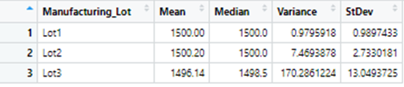
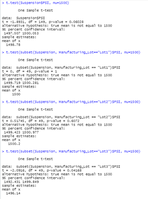

# MechaCar_Statistical_Analysis

## Linear Regression to Predict MPG

The largest non-random variance would be the vehicle length which has a p-value of 2.60e-12.   The other large non-random variance would
be the ground clearance which has a p-value of 5.21e-8.

The slope of the linear model would not be zero.   The non-zero slope coefficients of the vehicle length, ground clearance and AWD along with
the p-values which are lees than the significante level of p=.05 as seen from the chart above.

The model does predict mpg do the the r^2 value of .7149.

## Summary Statistics on Suspension Coils

The total summary shows the variance of 62 PSI which is under the total maximum variance of 100 PSI.

If we look at the individual lot sumary, we can see that lot 3 was over the total variance maximum at 170 PSI.   This would make lot 3 not allowed
in the design specification for the colil suspension.   It is important to calculate the individual variance in order to properly qualify the design
specification since the lots calculated in tandem did pass.

## T-Tests on Suspension Coils

Looking at the first t-test, the sample mean in not statistically different from the population mean of 1500 PSI which has a p-value of .06.

Looking at the individual t-tests, we can see that lot 1 and 2 are not statistically different from the population mean with p-values of 1 and .6.  
Lot 3 is statistically different from the population mean with a p-value of .04.

## Study Design: MechaCar vs Competition

There are a few metrics to consider when comparing the MechaCar against the competion.   These metrics would include cost of vehicle, city and highway mpg,
horse poewer, and over all safety rating.   We would need to compare these metrics to the competision to determine statistical significants.   The null hypothesis
would be that metrics do not vary significantly from the competition and the alternative hypothesis would be that they do vary signifficantly from the competition.
A one-tailed t-test would be used with these metrics.   Different results would be ideal such as horse power and fuel efficient to be significantly different.
This would be in the directin of more fuel efficientcy and higher horse powere then the competition.  We would want the saftey rating to be greater than the competitors also.   We would need the gather these metrics form the competitionas well as using our own to create the stistically significance.

