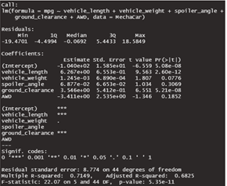

# MechaCar_Statistical_Analysis

## Linear Regression to Predict MPG

The largest non-random variance would be the vehicle length which has a p-value of 2.60e-12.   The other large non-random variance would
be the ground clearance which has a p-value of 5.21e-8.

The slope of the linear model would not be zero.   The non-zero slope coefficients of the vehicle length, ground clearance and AWD along with
the p-values which are lees than the significante level of p=.05 as seen from the chart above.

The model does predict mpg do the the r^2 value of .7149.

## Summary Statistics on Suspension Coils

